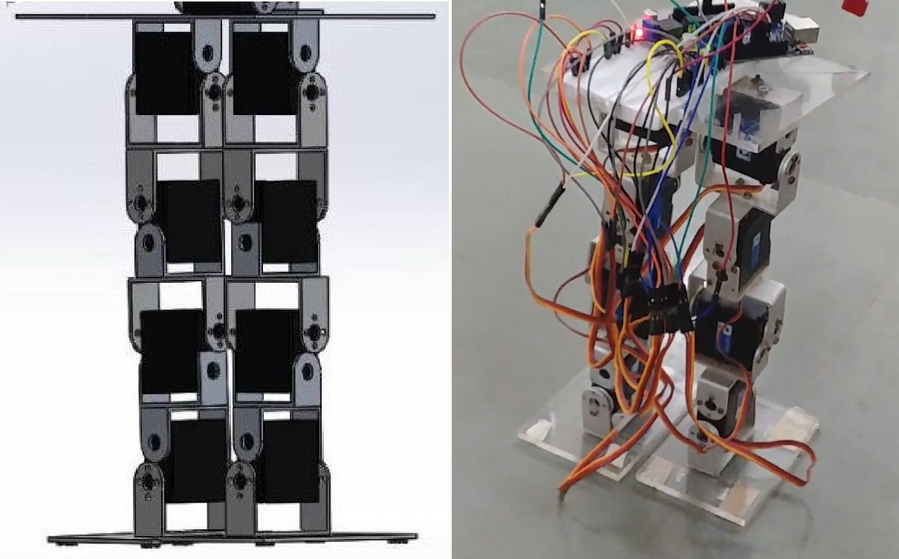
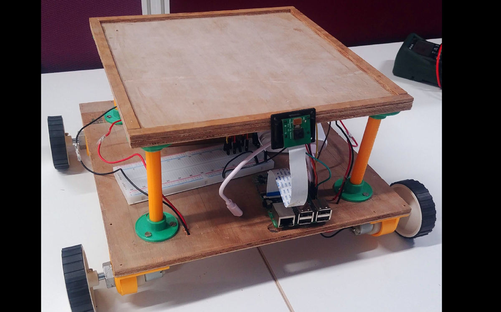

### Robotics Projects

<ul class="posts">
	<li>
		<a href="{{ site.baseurl }}/projects/dextroid/" style="text-decoration:none;">
		
    
 
				<b>
				   &nbsp;&nbsp; Dextroid -The Humanoid
				</b>
			

		</a>
	</li>
	 
   
	<li>
		<a href="{{ site.baseurl }}/projects/alfa/" style="text-decoration:none;">
		
			

				<b>
			  	&nbsp;&nbsp; ALFA -APTRI Labs Floor Assistant
				</b>
			

		</a>
	</li>	
	 
   
  <li>
		<a href="{{ site.baseurl }}/projects/3_project/" style="text-decoration:none;">
		
			

				<b>
				HIVE: An effort to make multi robot system showcasing Swarm Intelligence.
				</b>
			

		</a>
	</li>
</ul>
	
<!--div class="projects grid">

  
  
  

    
    <a href="{{ project.redirect }}" target="_blank">
    
    <a href="{{ project.url | relative_url }}">
    
      

        
        
        
        

          <h2 class="card-title text-lowercase">{{ project.title }}</h2>
          
{{ project.description }}

          

            
            

              

                <a href="{{ project.github }}" target="_blank"><i class="fab fa-github gh-icon"></i></a>
              

              
              
                <i class="fas fa-star"></i>
                
              
              
            

            
          

        

      

    </a>
  



</div-->
